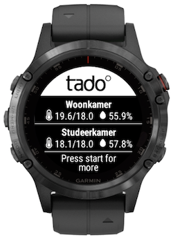
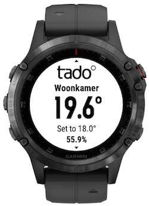

# tado° CIQ widget

A [Garmin Connect IQ widget](https://developer.garmin.com/connect-iq/overview/)
to display information from your tado° smart thermostat on your Garmin
device.

 

This is still a work in progress. New features will be introduced in the future.
If you have questions, ideas or found a bug, please
[create an issue](https://github.com/MGHollander/tado-ciq-widget/issues/new/choose).

The widget depends on data from the
[tado° Connect IQ bridge](https://github.com/MGHollander/tado-ciq-bridge).
This API serves tailored made data data to make the traffic as fast as possible.

*This widget is not build by tado°.*

## Features

- An overview of the current temperature, the set temperature and the humidity
  in your zones.
- Navigate through all zones, separate from each other.
- If you have multiple homes then the widget will ask you to choose a home from
  which the zones will be displayed (it is not yet possible to change to
  another home).

## Device support

At this moment the widget is in alpha phase and only supports the Fenix 5 plus.
Support for other devices will be added  in the future.

You are free to download the source of the widget and compile it for your own
device. It is not tested (yet) on any other device then the Fenix 5 plus though.

## Installation

- Download the package for your device from the
  [releases page](https://github.com/MGHollander/tado-ciq-widget/releases).
- Connect your device to your computer using a USB cable.
- Place the package in the `Garmin/Apps` folder on your device.

## Notes

- The main screen only shows 2 zones. You can sort the zones in the Tado app.

## Todo

- Create issues for all other todo items.
- Check if all web requests use the TadoTransaction.
- Fix the build warning "BUILD: WARNING: This is a 'widget' app type but no
  source code was annotated with (:glance). The entire application will be
  loaded as a glance process. (glance application)".
- Use System.error() to report errors in the production app.
- Replace the hidden access modifier for protected, since hidden is just a
  synonym..
- Use the screen height to determine how many zones can be displayed on the
  screen.
- Test the 401 handling in the onReceive method of TadoTransaction. Is this
  working as expected?
- Test the error handling in the accessCodeResult method of the login
  transaction. Is this working as expected?
- Remove all debug information.
- Add unit tests (<https://developer.garmin.com/connect-iq/core-topics/unit-testing/>).
- Add error reporting (<https://developer.garmin.com/connect-iq/core-topics/exception-reporting-tool/>).
- ~Move the app code into a separate dir and move unused images from the app dir
  to a separate dir.~
- ~Make an API call to get all zones at once.~
- ~Clean out most of the code copied from the Strava API widget and start at the
  beginning for the tado widget (no code that is not needed yet).~

## Feedback

Please feel free to give feedback, share ideas or report bugs. Email me at
[marc@mghollander.nl](mailto:marc@mghollander.nl) or
[add an issue](https://github.com/MGHollander/tado-ciq-widget/issues).

## Donate

I work on this widget in my free time, but you can support me by making a
donation (or buy me a beer) via <https://paypal.me/mghollander>. It will be
appreciated a lot!
